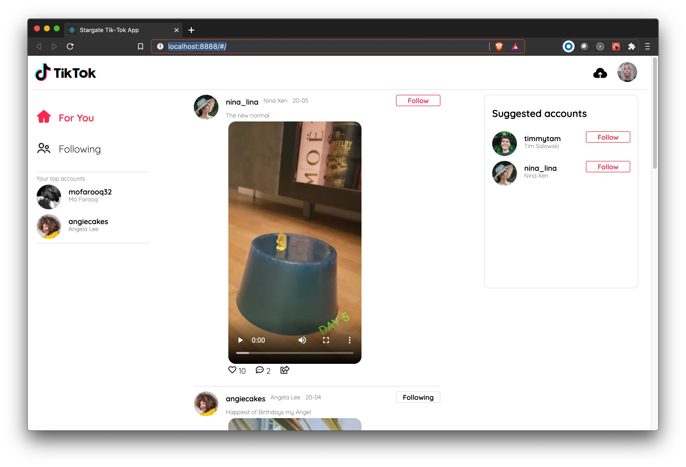

<!--- STARTEXCLUDE --->
# Astra DB TikTok Clone Workshop *with CodeTour*

*50 minutes, Intermediate, [Start Building](#running-astra-tik-tok)*

A simple Tik-Tok clone running on Astra DB that leverages the Document API.
<!--- ENDEXCLUDE --->

## Table of content

- [Objectives](#objectives)
- [Frequently asked questions](#frequently-asked-questions)
- [Materials for the Session](#materials-for-the-session)
- [Hands-on](#hands-on)
- [Homework](#homework)
- [Introduction to JamStack](#1-introduction-to-the-jamstack)
- [Why this is cool ?](#2-why-this-is-cool-)
- [Introduction to Netlify](#3-introduction-to-netlify)
- [Video tutorial with Ania Kubow](#video-tutorial-with-ania-kubow)

## Objectives

* Deploy a TikTok clone "locally" and to production
* Learn how to use the @astrajs document API to quickly and easily interact with JSON documents
* Leverage Netlify and DataStax AstraDB

## Frequently asked questions

- *What other prerequisites are there?*
> * You will need a **github account**
> * You will also need Netlify and Astra DB accounts, but we'll work through that in the exercises
> * Use **Chrome** or **Firefox** for the best experience. Other browsers are great, but don't work well with the GitPod integration we use a bit later.

- *Do I need to pay for anything for this workshop?*
> * No. All tools and services we provide here are FREE.

## Materials for the Session

It doesn't matter if you join our workshop live or you prefer to do at your own pace, we have you covered. In this repository, you'll find everything you need for this workshop:

- [Slide deck](./slides/slides.pdf)
- [Discord chat](https://bit.ly/cassandra-workshop)
- [Questions and Answers](https://community.datastax.com/)

## Hands-on

- Click the button to launch the GitPod IDE from **YOUR** repository.

* _Supported by  Chrome and  Firefox_

## Homework

Don't forget to complete your upgrade and get your verified skill badge! Finish and submit your homework!

1. Complete the practice steps from this repository as described in the codetour Make screenshots alongside the steps and show us your deployed production TikTok clone up in Netlify.
2. (Optional extra credit) Watch the 2 hour Ania video [HERE](#video-tutorial-with-ania-kubow), build the app yourself, and show us the completed app.
3. Submit your homework [here](https://github.com/datastaxdevs/workshop-tiktok-codetour/issues/new?assignees=HadesArchitect&labels=homework%2Cpending&template=homework-assignment.md&title=%5BHW%5D+%3CNAME%3E)

That's it, you are done! Expect an email next week!

## Informations and courses

### 1. Introduction to the JAMStack

> *Sources [JamStack.org](https://jamstack.org/) and [Netlify Documentation](https://www.netlify.com/jamstack/)*

Jamstack is the new standard architecture for the web. Using Git workflows and modern build tools, pre-rendered content is served to a CDN and made dynamic through APIs and serverless functions. Technologies in the stack include JavaScript frameworks, Static Site Generators, Headless CMSs, and CDNs.

**🔵 Javascript:** can represent any modern Javascript/Typescript framework like `React`, `Vue`, or `Angular` or even vanilla JS.
<table>
 <tr>
  <td></td>
  <td><a href="https://reactjs.org/">ReactJS (we will use it today)</a> </td>
 </tr>
 <tr>
  <td></td>
  <td><a href="https://angular.io/docs">Angular</a></td>
 </tr>
<tr>
  <td></td>
 <td><a href="https://vuejs.org/">VueJS</a></td>
 </tr>
</table>

 

**🔵 API:** is a backend serving real time data through either REST or GraphQL, endpoints to interact with fetch, ajax,axios

<table>
  <tr>
  <td></td>
 <td><a href="https://vuejs.org/">REST (we will use it today)</a></td>
 </tr>
<tr>
  <td></td>
 <td><a href="https://graphql.org/learn/">GraphQL</a></td>
 </tr>
</table>

 

**🔵 Markup:** can be either plain old HTML or static content like markdown. This is the nature of markup that will determine the static page generator technology

<table>
 <tr>
  <td></td>
 <td><a href="https://developer.mozilla.org/en-US/docs/Web/Guide/HTML/HTML5/">Vanilla HTML (we will use this today)</a></td>
 </tr>
 <tr>
  <td></td>
 <td><a href="https://www.markdownguide.org/">Markdown</a></td>
 </tr>
</table>

 

**🔵 Static page generator**

They apply data and content to templates, and generate a view of a page which can be served to the visitors of a site.

The greatest difference between a static site generator and a traditional web application stack, is that instead of waiting until a page is requested and then generating its view on demand each time, a static site generator does this in advance so that the view is ready to serve ahead of time. And it does so for every possible view of a site at build time.

It improves performance and high compatibility with its rendering. *Automates code splitting, image optimization, inlining critical styles, lazy-loading, prefetching resources, and more to ensure your site is fully optimized. No manual tuning required.* 

You can find a pretty exhaustive list [here](https://jamstack.org/generators/).

**🔵 CDN:** : geographically distributed group of servers which work together to provide fast delivery of Internet content.

A CDN allows for the quick transfer of assets needed for loading Internet content including HTML pages, javascript files, stylesheets, images, and videos. The popularity of CDN services continues to grow, and today the majority of web traffic is served through CDNs, including traffic from major sites like Facebook, Netflix, and Amazon.

**🔵 Logical Architecture** 

 The core principles of **pre-rendering**, and **decoupling**, enable sites and applications to be delivered with greater confidence and resilience than ever before.

**🔵 Pre-rendering:** 

**🔵 Decoupling:** 

**🔵 Move to CDN:** 

### 2. Why this is cool ?

#### 🔐 2.1 - Security

> *Do you remember `/wp-admin.php` ? Me too.* The elder Cedrick

The Jamstack removes multiple moving parts and systems from the hosting infrastructure resulting in fewer servers and systems to harden against attack.

Serving pages and assets as pre-generated files allows **read-only hosting** reducing attack vectors even further. Meanwhile dynamic tools and services can be provided by vendors with teams dedicated to securing their specific systems and providing high levels of service.

#### 🌐 2.2 - Scalalibility

> *Have you ever Ddos Amazon CloudFront ? Neither have I* the elder Cedrick.

When sites can be served entirely from a CDN there is no complex logic or workflow to determine what assets can be cached and when.

With Jamstack sites everything can be cached in a content delivery network. With simpler deployments, built-in redundancy and **incredible load capacity.**

#### 🚀 2.3 - Performance

Page loading speeds have an impact on user experience and conversion. Jamstack sites remove the need to generate page views on a server at request time by instead generating pages ahead of time during a build.

With all the pages are already available on a CDN close to the user and ready to serve, very high performance is possible without introducing expensive or complex infrastructure.

#### 🆘 2.4 - Maintainability

When hosting complexity is reduced, so are maintenance tasks. A pre-generated site, being served directly from a simple host or directly from a CDN does not need a team of experts to "keep the lights on".

The work was done during the build, so now the generated site is stable and can be hosted without servers which might require patching, updating and maintain.

#### 📦 2.5 - Portability

Jamstack sites are pre-generated. That means that you can host them from a wide variety of hosting services and have greater ability to move them to your preferred host. Any simple static hosting solution should be able to serve a Jamstack site.

Bye-bye infrastructure lock-in.

#### 💡 2.6 - Developer Experience

Let us show you this one today

### 3. Introduction to Netlify

> *Source [https://www.netlify.com](https://www.netlify.com/)*

#### 3.1 Netlify in a nutshell

**Decoupling the frontend from the backend**: Unlike the large legacy apps, Jamstack projects neatly separate the frontend pages and UI from the backend apps and databases. Freed from backend servers, the frontend can then be deployed globally, directly to a CDN.

**Dynamic content via APIs**: The global frontend uses Javascript and APIs to talk to backend services, allowing pages to be enhanced and personalized.

*overview of netlify*

## Video tutorial with Ania Kubow

Thank you to our wonderful friend Ania Kubow for producing the TikTok clone. If you are not aware of Ania and love learning about coding you should absolutely check out her YouTube channel listed below.

While we focused on getting you up and running to production with Astra DB and Netlify, Ania's video will dig into more details on the app itself. Check it out to dig in more.

We're using Create-React-App and the Astra DB Document API to create a simple Tik-Tok clone.  Follow along in this video tutorial: [https://youtu.be/IATOicvih5A](https://youtu.be/IATOicvih5A).

Follow the instructions below to get started.

### Video Content:
- [https://youtu.be/IATOicvih5A](https://youtu.be/IATOicvih5A)
- (00:00) Introduction
- (03:05) Creating our Database on DataStax
- (06:52) Setting up our App
- (12:37) Routing Pages
- (18:02) Creating Components
- (28:32) Introduction to Data with Netlify and Stargate
- (30:10) Introduction to using the astrajs/collections
- (34:01) Posting data to our Database (creating dummy Tik Tok posts)
- (34:01) Adding authorization to access our Database
- (43:10) Getting data from our Database (getting all our Tik Tok posts)
- (50: 32) Viewing all our Data
- (51:56) Rendering components based on our Data
- (01:17:01) Editing our Data (following/unfollowing a user)
- (01:32:57) Adding new Data to our Database (creating a Tik Tok post)

### If you did like this video, please hit the Like and Subscribe button so I know to make more!
- Twitter: https://twitter.com/ania_kubow
- YouTube: https://youtube.com/aniakubow
- Instagram: https://instagram.com/aniakubow
<!--- ENDEXCLUDE --->
